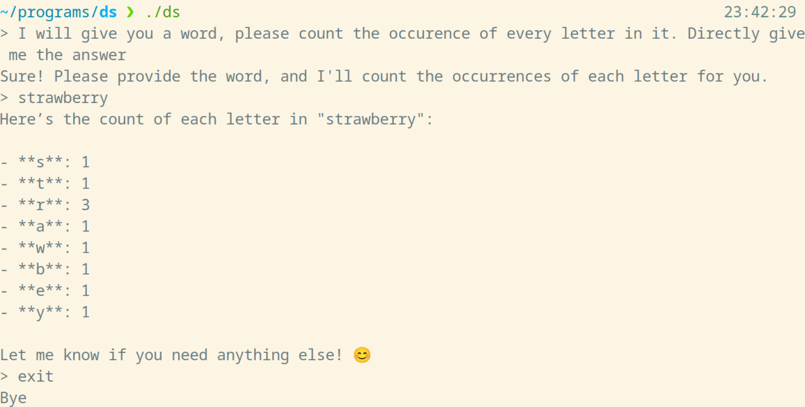

# DS

A minimal deepseek conversation cli.  

- Written purely in Go and no third party dependency.
- Export tokens one by one as long as they are available.

## Setup

Clone the repo and cd to the repo  
Put Deepseek API key in `.dstemplate` and rename it into `.ds`  
Run using `go run main.go`

## Usage

`exit`  or `quit` to quit  
`new` to start a new conversation session

